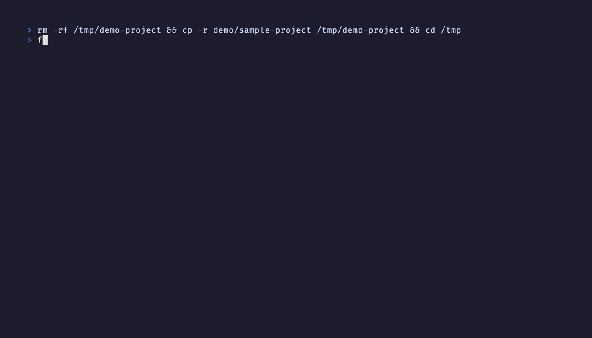

# FileView (fv)

[](https://crates.io/crates/fileview)
[](https://crates.io/crates/fileview)
[](https://github.com/Hiro-Chiba/fileview/actions/workflows/ci.yml)
[](https://opensource.org/licenses/MIT)
[](https://www.rust-lang.org)

> Browse files with image previews, Git status, and search in your terminal. No configuration needed.

<p align="center">
  
</p>

## Quick Start

[Download a prebuilt binary](https://github.com/Hiro-Chiba/fileview/releases/latest)
for your OS. Rust is not required. Choose the archive with the matching filename
ending below, then extract it and run the included executable from a terminal.

| System | Archive filename ending |
| --- | --- |
| macOS, Apple Silicon | `aarch64-apple-darwin.tar.gz` |
| macOS, Intel | `x86_64-apple-darwin.tar.gz` |
| Linux, x86-64 (GNU) | `x86_64-unknown-linux-gnu.tar.gz` |
| Windows, x86-64 | `x86_64-pc-windows-msvc.zip` |

The Linux binary requires glibc 2.39 or newer. For older glibc versions or
musl-based systems, use the Cargo installation below to build for your environment.

### macOS and Linux

Save your downloaded archive as `fileview.tar.gz`. In the folder containing it, run:

```sh
tar -xzf fileview.tar.gz
./fv
```

To install for your user, run these commands from the same folder:

```sh
mkdir -p "$HOME/.local/bin"
install -m 755 ./fv "$HOME/.local/bin/fv"
export PATH="$HOME/.local/bin:$PATH"
fv
```

The `export` applies to the current terminal session. If `~/.local/bin` is not
already on your `PATH`, add that line to your shell's startup file to use `fv`
in new terminals. Repeat the download and `install` steps to update.

### Windows (PowerShell)

Save your downloaded archive as `fileview.zip`. In the folder containing it, run:

```powershell
Expand-Archive -Path .\fileview.zip -DestinationPath .\fileview
.\fileview\fv.exe
```

To use `fv` from any folder or in the MCP configuration below, place the executable
in a directory on your `PATH`.

### First minute

Start FileView in a project folder. Use `j/k` or the up/down arrows to select a
file, `l` to expand a directory, and `h` to collapse it. Press `P` to show the
preview, then move between source files and images. Press `/` to search or
`Ctrl+P` to find a file by name. Press `?` for help and `q` to quit.

### Install with Cargo

If you already have Rust 1.90 or newer:

```sh
cargo install fileview --locked
fv
```

FileView 3.0 adds background Ctrl+P search and structured
filters through the same engine as `fv search 'ext:rs type:file' .` and MCP.
Use `text:TODO` in Ctrl+P, `fv search 'text:TODO' --json`, or MCP to search
file contents with optional ripgrep (`rg`). Selecting a content result opens
the matching line. Text previews read bounded pages as you scroll. See
[the design and validation notes](docs/WORKSPACE_ENGINE.md) for its current limits.
See [what changed in 3.0](CHANGELOG.md#300---2026-10-05) for examples and upgrade notes.

## Features

- Image previews with automatic terminal detection (Kitty, iTerm2, Sixel, Halfblocks)
- Git status, syntax highlighting, search, and fuzzy finder
- Video thumbnails and metadata with FFmpeg installed
- PDF previews with Poppler installed
- Vim keybindings, mouse support, Lua plugins
- Live reflection of `fv --mcp-server` activity in the TUI ([details](docs/CLAUDE_CODE.md))

See the [performance comparison](docs/BENCHMARKS.md) for local measurements and
their test conditions.

## Install Options

Chafa image support: `cargo install fileview --features chafa`<br>
Speed-optimized build: `cargo install fileview --profile release-fast`<br>
Slim build (drops `arboard` clipboard, `mlua` Lua plugin,
`zip` / `tar` / `flate2` archive, and `tiktoken-rs` /  `petgraph`
AI helper dependencies): `cargo install fileview --no-default-features`<br>
Pick individual features: `cargo install fileview --no-default-features --features ai,clipboard,lua,archive`

### Optional preview tools

File browsing, text previews, image previews, and filename search work without these tools.
Install only the tools for the features you want, then restart FileView.

| Feature | Required tools |
| --- | --- |
| Content search (`text:`) | ripgrep (`rg`) |
| Git status and diffs | `git` |
| Video thumbnails | FFmpeg's `ffmpeg` and `ffprobe` |
| Video duration, resolution, and codec information | FFmpeg's `ffprobe` |
| PDF pages and page counts | Poppler's `pdftoppm` and `pdfinfo` |

If a video or PDF preview is unavailable, check that the required tools are
installed and available on your `PATH`. Image previews adapt to your terminal
as described below.

## Image Preview

Your terminal is auto-detected:

| Terminal | Protocol |
|----------|----------|
| Kitty / Ghostty / Konsole | Kitty Graphics |
| iTerm2 / WezTerm / Warp | iTerm2 Inline |
| Foot / Windows Terminal | Sixel |
| VS Code / Alacritty | Halfblocks |

## Keybindings

| Key | Action |
|-----|--------|
| `j/k` | Navigate up/down |
| `h/l` | Collapse/expand |
| `g/G` | Top/bottom |
| `Space` | Toggle mark |
| `/` | Search |
| `Ctrl+P` | Fuzzy finder |
| `P` | Preview panel |
| `?` | Help |
| `q` | Quit |

See [docs/KEYBINDINGS.md](docs/KEYBINDINGS.md) for the full list.

## One-shot helpers for AI workflows

A few non-interactive flags for use from scripts and AI agents:

```bash
fv --tokens README.md            # cl100k_base token estimate (one integer to stdout)
fv --snapshot-create base        # capture working tree manifest to .fileview/snapshots/
fv --snapshot-diff base          # + added / - removed / M modified since snapshot
fv --watch path/to/file          # block until the file changes, print path, exit
fv --watch path/to/file --watch-timeout-secs 5
```

See [docs/CLAUDE_CODE.md](docs/CLAUDE_CODE.md) for the full list.

## Claude Code Integration

FileView includes an MCP server for Claude Code (`fv --mcp-server`).

```json
{
  "mcpServers": {
    "fileview": {
      "command": "fv",
      "args": ["--mcp-server"]
    }
  }
}
```

Details: [docs/CLAUDE_CODE.md](docs/CLAUDE_CODE.md)

## Docs

- [Keybindings](docs/KEYBINDINGS.md)
- [Claude Code / MCP](docs/CLAUDE_CODE.md)
- [Lua Plugins](docs/PLUGINS.md)
- [Performance comparison](docs/BENCHMARKS.md)


## License

MIT
