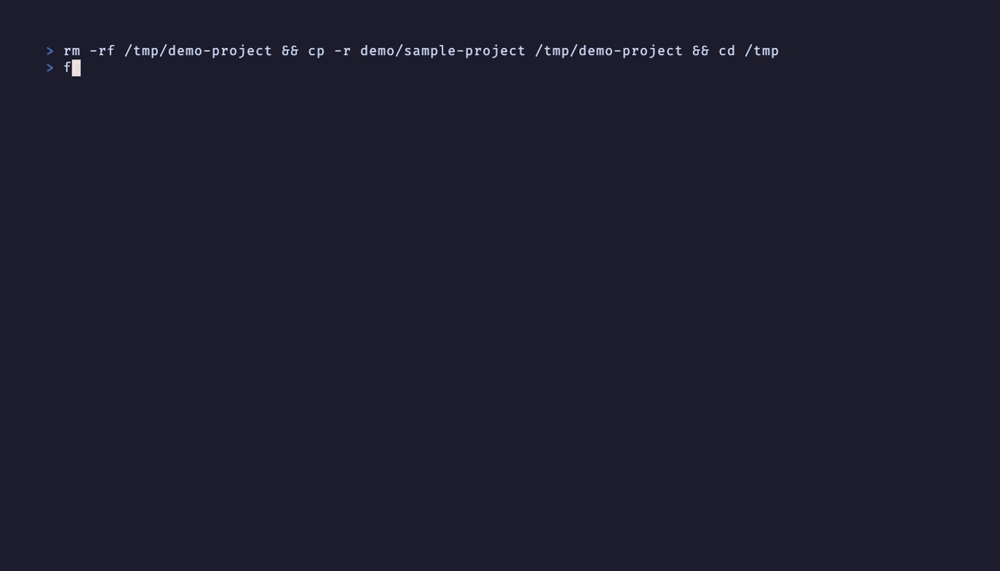

# FileView (fv)

[](https://crates.io/crates/fileview)
[](https://crates.io/crates/fileview)
[](https://github.com/Hiro-Chiba/fileview/actions/workflows/ci.yml)
[](https://opensource.org/licenses/MIT)
[](https://www.rust-lang.org)

> 設定不要のターミナルファイルブラウザ。画像プレビュー自動検出、Rust製。

[English](README.md) | 日本語

## デモ

<p align="center">
  
</p>

yaziのような軽量ファイルマネージャーで、普段使いしながらClaude Codeとも連携できるものが欲しかった。設定ファイルに時間をかけたくなかった。

## 特徴

- 画像プレビュー自動検出（Kitty, iTerm2, Sixel, Halfblocks）
- 起動 2.2ms、メモリ約 8MB（[ベンチマーク](docs/BENCHMARKS.md)）
- Git連携、シンタックスハイライト、PDFプレビュー、ファジーファインダー
- Vimキーバインド、マウス対応、Luaプラグイン

## クイックスタート

```bash
cargo install fileview
fv
```

## インストールオプション

Chafa画像サポート: `cargo install fileview --features chafa`<br>
速度最適化ビルド: `cargo install fileview --profile release-fast`

## 画像プレビュー

ターミナルを自動検出します:

| ターミナル | プロトコル |
|-----------|-----------|
| Kitty / Ghostty / Konsole | Kitty Graphics |
| iTerm2 / WezTerm / Warp | iTerm2 Inline |
| Foot / Windows Terminal | Sixel |
| VS Code / Alacritty | Halfblocks |

## キーバインド

| キー | 動作 |
|------|------|
| `j/k` | 上下移動 |
| `h/l` | 折りたたみ/展開 |
| `g/G` | 先頭/末尾 |
| `Space` | マーク切り替え |
| `/` | 検索 |
| `Ctrl+P` | ファジーファインダー |
| `P` | プレビューパネル |
| `q` | 終了 |

全キーバインドは [docs/KEYBINDINGS_ja.md](docs/KEYBINDINGS_ja.md) を参照。

## Claude Code 連携

FileView は Claude Code の MCP サーバーとして使えます（`fv --mcp-server`）。

```json
{
  "mcpServers": {
    "fileview": {
      "command": "fv",
      "args": ["--mcp-server"]
    }
  }
}
```

詳細: [docs/CLAUDE_CODE_ja.md](docs/CLAUDE_CODE_ja.md)

## ドキュメント

- [キーバインド](docs/KEYBINDINGS_ja.md)
- [Claude Code / MCP](docs/CLAUDE_CODE_ja.md)
- [Luaプラグイン](docs/PLUGINS_ja.md)
- [他のファイルマネージャとの比較](docs/COMPARISON.md)

## ライセンス

MIT
